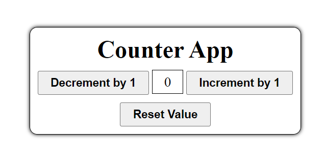

# Counter App

A simple counter application created using HTML, CSS, and JavaScript. This application includes three buttons: one to increment the counter, one to decrement the counter, and one to reset the counter to zero.

## Features

- Increment the counter by 1
- Decrement the counter by 1
- Reset the counter to 0

## Screenshot



## Getting Started

Follow these instructions to get a copy of the project up and running on your local machine.

### Prerequisites

You will need a web browser to view the application.

### Installation

1. Clone the repository:
   ```bash
   git clone https://github.com/your-username/counter-app.git
   ```

2. Navigate to the project directory:
   ```bash
   cd counter-app
   ```

3. Open `index.html` in your web browser to view the application.

## Usage

- Click on the "Increment by 1" button to increase the counter value.
- Click on the "Decrement by 1" button to decrease the counter value.
- Click on the "Reset Value" button to reset the counter to 0.
